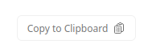

# Pines.TagHelpers


[](https://www.nuget.org/packages/Pines.TagHelpers)
[](https://www.nuget.org/packages/Pines.TagHelpers)

Pines.TagHelpers is a collection of ASP.NET Core TagHelpers based on
the [Pines UI components library](https://devdojo.com/pines) using Alpine.js and Tailwind CSS.

## Installation

You can install the package via NuGet:

```bash
dotnet add package Pines.TagHelpers
```

## Usage

Add Alpine.js and Tailwind CSS to your `_Layout.cshtml`:

```chtml
<script src="//unpkg.com/alpinejs" defer></script>
```

Add the `Pines.TagHelpers` to your `_ViewImports.cshtml`:

```csharp
@addTagHelper *, Pines.TagHelpers
```

## Components

### CopyToClipboard

```cshtml
<copy-to-clipboard text="@Model.TextToBeCopied"></copy-to-clipboard>
```

Preview:



## Want to contribute?

This project is just getting off the ground and could use some help with cleaning things up and refactoring.

If you want to contribute - we'd love it! Just open an issue to work against so you get full credit for your fork. You can open the issue first so we can discuss and you can work your fork as we go along.

If you see a bug, please be so kind as to show how it's failing, and we'll do our best to get it fixed quickly.

Before sending a PR, please [create an issue](https://github.com/AlexZeitler/Pines.TagHelpers/issues/new) to introduce your idea and have a reference for your PR.

We're using [conventional commits](https://www.conventionalcommits.org), so please use it for your commits as well.

### Discussions

If you want to discuss an `Pines.TagHelpers` issue or PR in more detail, feel free to [start a discussion](https://github.com/AlexZeitler/Pines.TagHelpers/discussions).

## License

The MIT License (MIT). Please see [License File](LICENSE) for more information.
